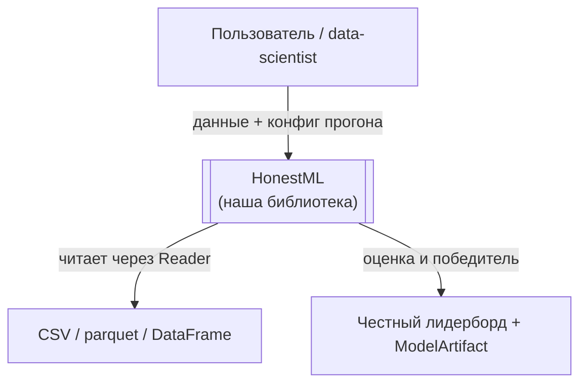
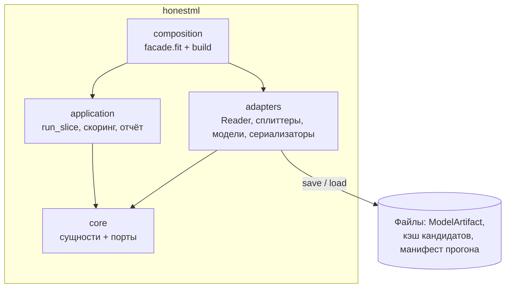
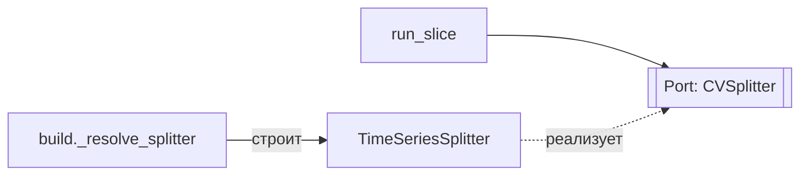
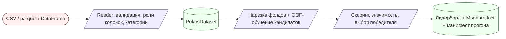
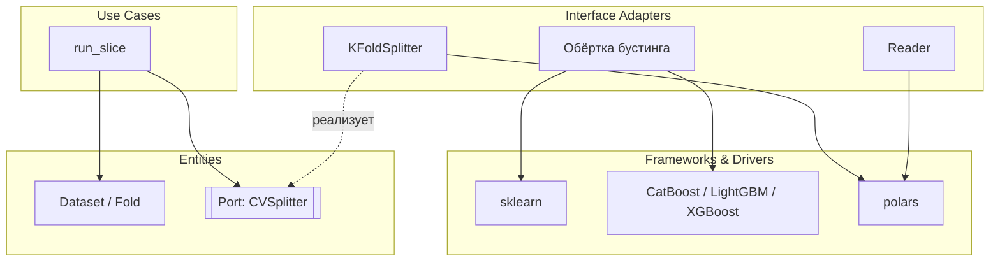

# Диаграммы: C4, DFD, граф зависимостей (Mermaid)

Все диаграммы — в Mermaid внутри markdown, чтобы рендерились в репозитории.
Минимум визуального шума, максимум смысла. Подписи — на русском.

## C4 — уровни

C4 описывает систему сверху вниз. Рисуй ровно столько уровней, сколько нужно
для понимания; чаще всего достаточно Context + Container.

### Уровень 1 — System Context (кто и зачем пользуется системой)

### Уровень 2 — Container (пакеты библиотеки и то, что она пишет на диск)

### Уровень 3 — Component (модули внутри пакета; по необходимости)

Уровень 4 (код) обычно не рисуют — его роль выполняет сам код и граф зависимостей.

## DFD — Data Flow Diagram (потоки данных)

Показывает, как данные текут между процессами и хранилищами. Полезно для
пайплайнов: чтение и трансформации признаков, нарезка фолдов, путь инференса.

Обозначения: `([внешний источник])`, `[/процесс/]`, `[(хранилище)]`.

## Граф зависимостей + слои Clean Architecture

Ключевая проверка: **все стрелки направлены внутрь, к домену**. Если хоть одна
наружу — это нарушение правила зависимостей, отметь его явно.

Читать так: `run_slice` (use-case) зависит от порта `CVSplitter`, а
`KFoldSplitter` (адаптер) порт **реализует** — стрелка зависимости развёрнута
внутрь через DIP. Порты живут во внутреннем слое (`honestml.core.ports`),
связывание — в `honestml.composition`.

Нарушение (стрелка наружу или цикл) помечай отдельным классом, чтобы оно бросалось
в глаза на ревью: `classDef violation stroke:#c00,stroke-width:2px;` и применяй его
к нарушающему узлу через `узел:::violation`.

## Когда какую диаграмму

- **C4 Context/Container** — почти всегда, даёт общую карту.
- **C4 Component** — если внутри пакета нетривиальная структура.
- **DFD** — для пайплайнов данных (чтение и трансформации признаков, нарезка
  фолдов, путь инференса).
- **Граф зависимостей** — всегда при проектировании на Clean Architecture:
  он визуализирует правило зависимостей; доказывает правило дельта контрактов
  import-linter, которой артефакт завершается (фаза 6 SKILL).
